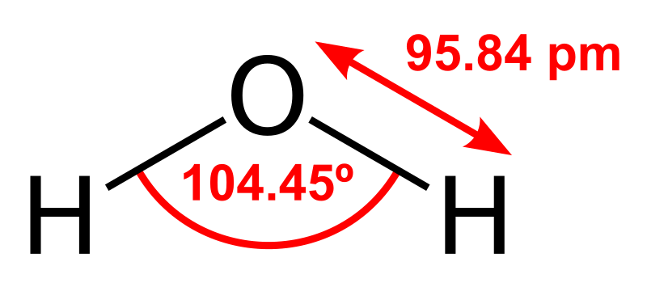

# Hello World #
* Or rather, “Hello, Git(Hub)!”

My first Repository, for introductory purposes only.

---

## Image & relative link _test_ ##


---

Did you know – the very original Hello World is a literal *block* exactly as follows:
```
hell
o, w
orld
```

This is because the very original origin of Hello World was the very first Hello World example for the language **B**, whose strings can only have a _maximum of 4_ (ASCII) characters.

__C__, (probably) the most well-known machine-friendly programming language, was motivated by B, if you didn’t realize. C used the exact same Hello World phrase as B to make B a joke to us.
```
hello, world
```

**B:** Am I a joke to you?\
**You:**